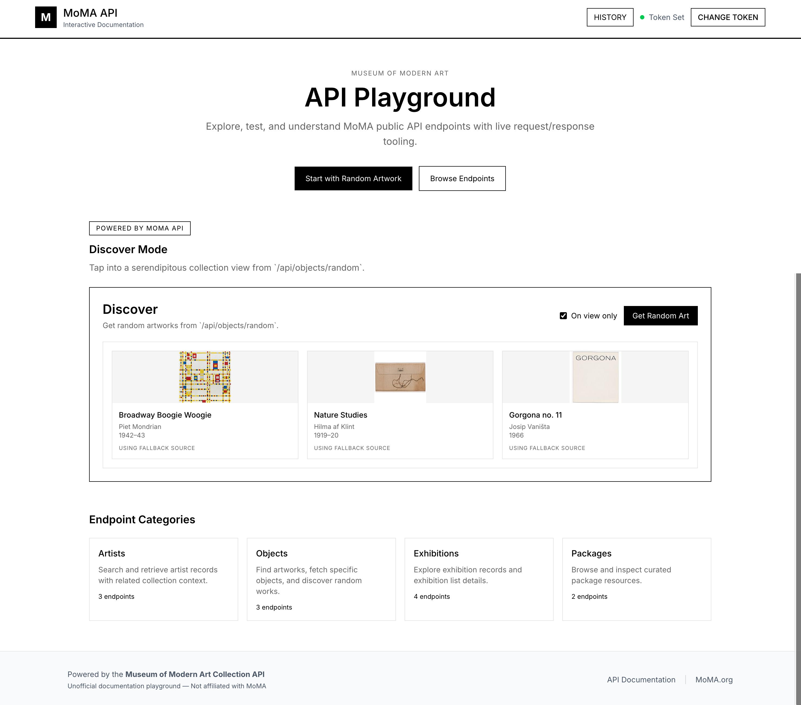
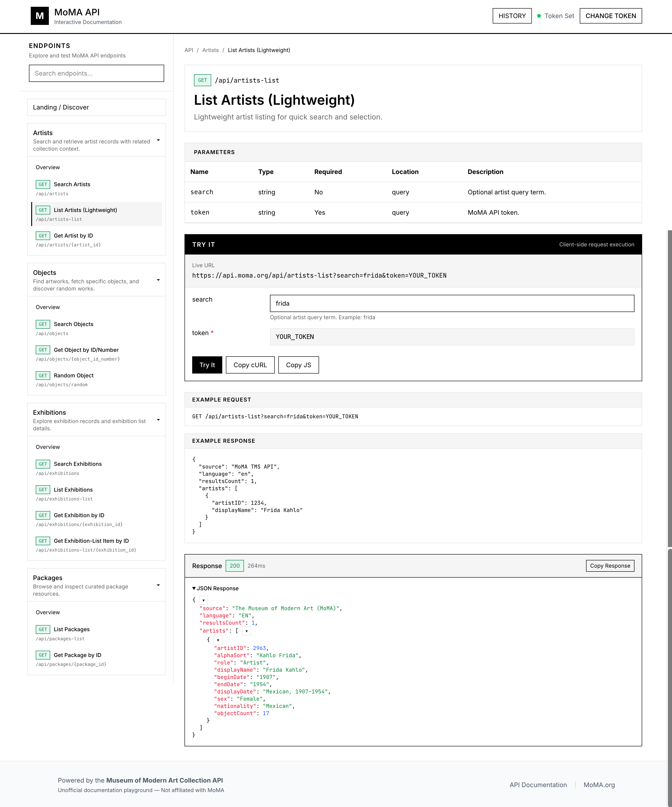

# MoMA API Playground (Astro)

Polished, interactive API documentation playground for `https://api.moma.org`, built with Astro, TypeScript, Tailwind, and React islands.

## Features

- Token manager modal with localStorage persistence and connection test
- Discover mode on landing page using `/api/objects/random`
- Full endpoint docs across Artists, Objects, Exhibitions, and Packages
- Per-endpoint interactive “Try It” request builder
- Live response viewer with status/timing, collapsible JSON explorer, Prism syntax highlighting
- Inline artwork visualization when image URLs are returned
- Request history drawer (last 10 requests in localStorage)
- Endpoint sidebar with category collapse + endpoint search quick-jump
- Breadcrumbs and responsive layout
- Toast notifications and loading skeletons

## Screenshots

### Landing / Discover Mode



### Endpoint Playground



## Routes

- `/`
- `/docs/artists`
- `/docs/artists/search`
- `/docs/artists/list`
- `/docs/artists/[id]`
- `/docs/objects`
- `/docs/objects/search`
- `/docs/objects/[id]`
- `/docs/objects/random`
- `/docs/exhibitions`
- `/docs/exhibitions/search`
- `/docs/exhibitions/list`
- `/docs/exhibitions/[id]`
- `/docs/exhibitions/list/[id]`
- `/docs/packages`
- `/docs/packages/list`
- `/docs/packages/[id]`

## Setup

```bash
pnpm install
pnpm dev
```

Then open the local URL from Astro (typically `http://localhost:4321`).

## Build

```bash
pnpm build
pnpm preview
```

## Deploy to GitHub Pages

This project is configured for GitHub Pages via `.github/workflows/deploy.yml`.

1. Push this project to a GitHub repository.
2. In GitHub, go to `Settings` → `Pages`.
3. Set **Source** to **GitHub Actions**.
4. Ensure your default deployment branch is `main`.
5. Push to `main` (or run the workflow manually from the Actions tab).

The Astro config uses `GITHUB_REPOSITORY` in CI to automatically set:

- `site`: `https://<owner>.github.io`
- `base`: `/<repo>`

For local builds, it defaults to `/`.

### Optional custom domain / subdomain support

You can override deploy URL behavior via GitHub Actions Variables:

- `PUBLIC_SITE_URL` (example: `https://api-playground.example.org`)
- `PUBLIC_BASE_PATH` (example: `/` for root domain, `/docs` for subpath hosting)

If these are not set, the workflow automatically uses default GitHub Pages conventions.

## Notes

- API calls are client-side only.
- Token is required by MoMA API and stored in `sessionStorage` + in-memory (survives refresh, clears on tab/window close).
- Request history stores sanitized URLs with token shown as `token=YOUR_TOKEN`.
- This project is not affiliated with MoMA.
